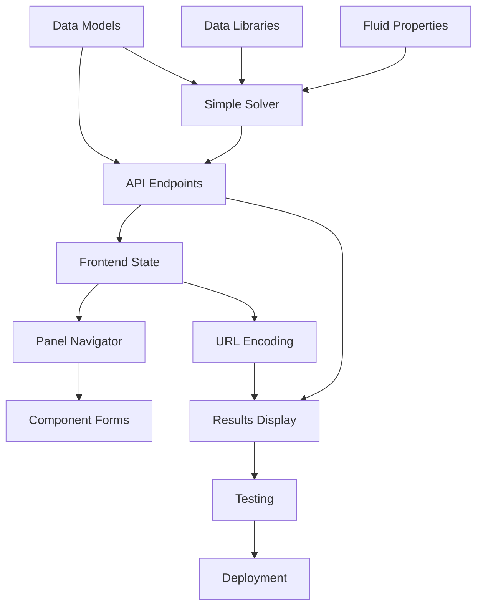

# OpenSolve Pipe - Development Plan

**Status:** ✅ Phase 1 Complete | Phase 2 In Planning
**Last Updated:** 2026-01-31

> **Progress Summary:** Phase 1 MVP is **100% complete**. All core features implemented. Advanced pump/valve features moved to Phase 2.
>
> ✅ **Phase 1 Complete:**
>
> - [x] All 25 core MVP issues complete (see [PHASE_1_ISSUES.md](./PHASE_1_ISSUES.md))
> - [x] Simple Solver for single-path networks
> - [x] Branching Solver for tree-structured networks (tee, wye, cross)
> - [x] Port-based architecture with elevation inheritance (ADR-007)
> - [x] Protocol-based interfaces (ADR-008)
> - [x] Reference nodes (ideal and non-ideal)
> - [x] Frontend: Panel Navigator, Forms, Results Display, URL Encoding
> - [x] CI/CD Pipeline (GitHub Actions, Vercel, Railway)
> - [x] 576+ backend tests, 119 frontend tests (>93% coverage)
> - [x] Pump/valve operating mode and status models
> - [x] Pump curve improvements (quadratic fit, BEP calculation)
> - [x] Dark mode support
>
> 📋 **Phase 2 Planned:** (see [PHASE_2_ISSUES.md](./PHASE_2_ISSUES.md))
>
> - [ ] Looped Network Solver (WNTR/EPANET integration)
> - [ ] Schematic Viewer (auto-generated visual diagram)
> - [ ] VFD pump control modes (controlled_pressure, controlled_flow)
> - [ ] Pump/valve status handling in solver
> - [ ] Enhanced UI controls for pump/valve modes

---

## Overview

This document outlines the phased development approach for OpenSolve Pipe, starting with a minimal viable product (MVP) and progressively adding features. Each phase is designed to be independently deployable and valuable to users.

**Guiding Principles:**

- Ship early and often
- Validate with real users after each phase
- Simple networks first, complex networks later
- Mobile-responsive from day one

---

## Architectural Foundation: Port-Based Connection Model

Before diving into implementation phases, it's important to understand the core architectural decisions that shape the data model.

### Connection Architecture

The hydraulic network uses a **port-based architecture**:

- **Components** are nodes with one or more **ports** (connection points)
- **Pipe connections** are edges that connect exactly two ports
- Each port has a **nominal size** that determines the connection diameter

### Component Port Configurations

| Component Type | Ports | Notes |
|----------------|-------|-------|
| Reservoir/Tank | 1-n | User-defined, each with configurable size |
| Reference Node (Ideal) | 1 | Fixed pressure boundary |
| Reference Node (Non-Ideal) | 1 | Pressure-flow curve boundary |
| Plug/Cap | 1 | Zero flow boundary (dead end) |
| Pump | 2 | Suction (inlet) + Discharge (outlet) |
| Valve | 2 | Inlet + Outlet |
| Branch (Tee/Wye) | 3 | Run + Branch ports |
| Branch (Cross) | 4 | Four-way intersection |
| Orifice | 2 | Inlet + Outlet |
| Sprinkler | 1 | Inlet only |

### Key Architectural Decisions

1. **Junction nodes are deprecated** in favor of explicit Branch components (tees, wyes, crosses)
2. **Branch components** provide proper K-factor calculations for flow splitting/combining
3. **Reference nodes** replace simple reservoir nodes for pressure boundary conditions
4. **Multi-port tanks/reservoirs** support real-world configurations with multiple connections
5. **Pipe connections** always have exactly two endpoints (no inline tees)

---

## Phase 1: MVP - Simple Solver + Basic UI

**Goal:** Prove the core concept with a working single-path solver and minimal UI

**Estimated Complexity:** Medium (3-4 weeks)

**Success Criteria:**

- ✅ Users can model a pump → pipe → tank system
- ✅ System solves correctly (< 1% deviation from EPANET)
- ✅ Results display flow, pressures, operating point
- ✅ Project state encodes to URL
- ✅ URL decodes back to working project
- ✅ Works on mobile (responsive design)
- ✅ Port-based connection model implemented
- ✅ Reference nodes (ideal) supported for boundary conditions
- ✅ Basic branch components (tee) supported for simple branching

### 1.1 Backend - Simple Solver (High Priority)

> ✅ **COMPLETED** - [GitHub Issue #10](https://github.com/ccirone2/opensolve-pipe/issues/10) | [PR #12](https://github.com/ccirone2/opensolve-pipe/pull/12)

**Files:**

- `apps/api/src/opensolve_pipe/services/solver/simple.py`
- `apps/api/src/opensolve_pipe/services/solver/friction.py`
- `apps/api/src/opensolve_pipe/services/solver/k_factors.py`

**Tasks:**

- [x] Implement Darcy-Weisbach friction factor calculation (Colebrook via `fluids` library)
- [x] Create head loss calculator for pipe segments (friction.py)
- [x] Implement K-factor resolution for fittings (Crane TP-410 L/D method)
- [x] Build system curve generator (head loss vs flow)
- [x] Create pump curve interpolator (cubic spline)
- [x] Implement operating point finder (Brent's method)
- [x] Calculate full network state at operating point (velocity, Reynolds, NPSH)

**Dependencies:** `fluids` library, `scipy` (for optimization)

**Complexity:** High - Core hydraulic calculations

---

### 1.2 Backend - Data Models (High Priority)

> ✅ **COMPLETED** - [GitHub Issue #5](https://github.com/ccirone2/opensolve-pipe/issues/5) | [PR #6](https://github.com/ccirone2/opensolve-pipe/pull/6)

**Files:** `apps/api/src/opensolve_pipe/models/`

**Tasks:**

- [x] Define Pydantic models for Project, Component, PipingSegment
- [x] Implement Reservoir, Tank, Junction models
- [x] Implement Pump model with curve handling
- [x] Create PipeDefinition and Fitting models
- [x] Define SolvedState output models
- [x] Add validation rules (physical bounds, required fields)

**Complexity:** Medium - Straightforward data modeling

---

### 1.3 Backend - Data Libraries (Medium Priority)

> ✅ **COMPLETED** - [GitHub Issue #7](https://github.com/ccirone2/opensolve-pipe/issues/7) | [PR #8](https://github.com/ccirone2/opensolve-pipe/pull/8)

**Files:** `apps/api/src/opensolve_pipe/data/`

**Tasks:**

- [x] Create `pipe_materials.json` (carbon steel, SS, PVC - Schedule 40/80)
- [x] Create `fittings.json` (elbows, tees, valves - Crane TP-410 L/D method)
- [x] Create `fluids.json` (water only for MVP)
- [x] Implement pipe material lookup service
- [x] Implement fitting K-factor lookup service (with f_T lookup)

**Complexity:** Low - Data entry and simple lookups

---

### 1.4 Backend - Fluid Properties (Medium Priority)

> ✅ **COMPLETED** - [GitHub Issue #9](https://github.com/ccirone2/opensolve-pipe/issues/9) | [PR #11](https://github.com/ccirone2/opensolve-pipe/pull/11)

**Files:**

- `apps/api/src/opensolve_pipe/services/fluids.py`
- `apps/api/src/opensolve_pipe/models/fluids.py`

**Tasks:**

- [x] Implement water property calculations (temp-dependent via `fluids` library)
- [x] Define FluidProperties model (density, viscosity, vapor pressure, specific gravity)
- [x] Add temperature unit conversion (Fahrenheit, Celsius, Kelvin)

**Dependencies:** `fluids` library for water properties

**Complexity:** Low - Library wrapper

---

### 1.5 Backend - Port-Based Architecture (High Priority)

> ✅ **COMPLETED** - [GitHub Issue #58](https://github.com/ccirone2/opensolve-pipe/issues/58) | [PR #64](https://github.com/ccirone2/opensolve-pipe/pull/64)

**Files:**

- `apps/api/src/opensolve_pipe/models/ports.py`
- `apps/api/src/opensolve_pipe/models/connections.py`

**Tasks:**

- [x] Define `Port` model (id, nominal_size, direction)
- [x] Define `PipeConnection` model (from/to component and port IDs)
- [x] Update all component models to include `ports` field
- [x] Add port factory functions for each component type
- [x] Update `PipingSegment` to support multiple pipe segments
- [x] Add validation for port connections (size compatibility, direction)
- [x] Write tests for port-based topology validation

**Complexity:** Medium - Core data model refactor

---

### 1.6 Backend - Reference Node and Plug Components (Medium Priority)

> ✅ **COMPLETED** - [GitHub Issue #59](https://github.com/ccirone2/opensolve-pipe/issues/59) | [PR #65](https://github.com/ccirone2/opensolve-pipe/pull/65)

**Files:**

- `apps/api/src/opensolve_pipe/models/reference_node.py`
- `apps/api/src/opensolve_pipe/models/plug.py`
- `apps/api/src/opensolve_pipe/services/solver/reference.py`

**Tasks:**

Reference Node:

- [x] Define `IdealReferenceNode` model (fixed pressure boundary)
- [x] Define `NonIdealReferenceNode` model (pressure-flow curve)
- [x] Implement reference node handling in simple solver
- [x] Add reference node to component type discriminator
- [x] Create frontend form for reference node configuration ([PR #68](https://github.com/ccirone2/opensolve-pipe/pull/68))
- [x] Write tests for reference node boundary conditions

Plug/Cap:

- [x] Define `Plug` model (zero flow boundary, 1 port)
- [x] Implement plug handling in simple solver (enforces Q=0)
- [x] Add plug to component type discriminator
- [x] Create frontend form for plug configuration ([PR #68](https://github.com/ccirone2/opensolve-pipe/pull/68))
- [x] Write tests for plug zero-flow enforcement

**Complexity:** Medium - New component types

---

### 1.7 Backend - Branch Component (Medium Priority)

> ✅ **COMPLETED** - [GitHub Issue #60](https://github.com/ccirone2/opensolve-pipe/issues/60) | [PR #66](https://github.com/ccirone2/opensolve-pipe/pull/66)

**Files:**

- `apps/api/src/opensolve_pipe/models/branch.py`
- `apps/api/src/opensolve_pipe/data/branch_k_factors.json`
- `apps/api/src/opensolve_pipe/services/solver/branch.py`

**Tasks:**

- [x] Define `TeeBranch` model (3 ports, orientation)
- [x] Define `WyeBranch` model (3 ports, angle)
- [x] Define `CrossBranch` model (4 ports)
- [ ] Define `ElbowBranch` model (3 ports, angles) - Deferred to Phase 2
- [x] Create branch K-factor lookup data (Crane TP-410)
- [x] Implement branch K-factor calculation (flow-dependent)
- [x] Add branch to component type discriminator
- [x] Create frontend forms for branch configuration ([PR #69](https://github.com/ccirone2/opensolve-pipe/pull/69))
- [x] Write tests for branch hydraulic calculations

**Complexity:** High - Complex K-factor calculations

---

### 1.7.1 Backend - Pump/Valve Operating Modes and Status (Medium Priority)

> ✅ **COMPLETED** - [GitHub Issue #103](https://github.com/ccirone2/opensolve-pipe/issues/103) | [PR #114](https://github.com/ccirone2/opensolve-pipe/pull/114)
> [GitHub Issue #104](https://github.com/ccirone2/opensolve-pipe/issues/104) | [PR #115](https://github.com/ccirone2/opensolve-pipe/pull/115)
> [GitHub Issue #105](https://github.com/ccirone2/opensolve-pipe/issues/105) | [PR #116](https://github.com/ccirone2/opensolve-pipe/pull/116)
> [GitHub Issue #106](https://github.com/ccirone2/opensolve-pipe/issues/106) | [PR #117](https://github.com/ccirone2/opensolve-pipe/pull/117)

**Files:**

- `apps/api/src/opensolve_pipe/models/components.py`
- `apps/api/src/opensolve_pipe/models/results.py`
- `apps/web/src/lib/models/components.ts`
- `apps/web/src/lib/models/results.ts`

**Tasks:**

Pump Operating Modes:

- [x] Add `PumpOperatingMode` enum (fixed_speed, variable_speed, controlled_pressure, controlled_flow, off)
- [x] Add `PumpStatus` enum (running, off_check, off_no_check, locked_out)
- [x] Update `PumpComponent` with operating_mode, status, control_setpoint fields
- [x] Add viscosity_correction_enabled field per ANSI/HI 9.6.7
- [x] Add validation for controlled modes requiring setpoints

Valve Status:

- [x] Add `ValveStatus` enum (active, isolated, failed_open, failed_closed, locked_open)
- [x] Update `ValveComponent` with status field

Enhanced Result Fields:

- [x] Add `ViscosityCorrectionFactors` model (c_q, c_h, c_eta)
- [x] Add `ControlValveResult` model for control valve behavior
- [x] Enhance `PumpResult` with status, actual_speed, viscosity correction
- [x] Enhance `SolvedState` with control_valve_results dictionary

TypeScript Sync:

- [x] Add TypeScript types matching backend enums
- [x] Add human-readable label maps for UI display
- [x] Update component and result interfaces
- [x] Update PumpForm component with new status values
- [x] Update example project with new fields

**Complexity:** Medium - Enum definitions and interface updates

---

### 1.8 Backend - API Endpoints (High Priority)

> ✅ **COMPLETED** - Full solver endpoint implemented ([Issue #71](https://github.com/ccirone2/opensolve-pipe/issues/71), [PR #73](https://github.com/ccirone2/opensolve-pipe/pull/73))

**Files:** `apps/api/src/opensolve_pipe/routers/`

**Tasks:**

- [x] Implement `/api/v1/solve` endpoint (uses SolverRegistry to select solver)
- [x] Implement `/api/v1/solve/simple` endpoint (pump-pipe systems)
- [x] Implement `/api/v1/fluids` endpoint
- [x] Implement `/api/v1/fluids/{fluid_id}/properties` endpoint
- [x] Add request/response validation
- [x] Add error handling and meaningful error messages
- [x] Set up CORS for frontend

**Complexity:** Medium - API plumbing

---

### 1.9 Backend - Unit Conversion (Medium Priority)

> ✅ **COMPLETED** - Implemented in core services

**File:** `apps/api/src/opensolve_pipe/utils/units.py`

**Tasks:**

- [x] Implement unit conversion system (length, pressure, flow)
- [x] Add unit validation
- [x] Create UnitPreferences model

**Complexity:** Medium - Careful handling of conversions

---

### 1.10 Frontend - Project State Management (High Priority)

> ✅ **COMPLETED** - Full store implementation with undo/redo

**Files:** `apps/web/src/lib/stores/`

**Tasks:**

- [x] Create project store (Svelte store)
- [x] Implement component chain management (add/remove/edit)
- [x] Add undo/redo history
- [x] Create current element navigation state
- [x] Implement derived stores for common queries
- [x] Add connection management (add/remove/update) ([PR #67](https://github.com/ccirone2/opensolve-pipe/pull/67))

**Complexity:** Medium - State management patterns

---

### 1.11 Frontend - URL Encoding/Decoding (High Priority)

> ✅ **COMPLETED** - Full encoding/decoding with compression

**File:** `apps/web/src/lib/utils/encoding.ts`

**Tasks:**

- [x] Implement project → JSON → gzip → base64url pipeline
- [x] Implement reverse decoding pipeline
- [x] Add error handling for corrupt URLs
- [x] Add size threshold detection (warn if > 2KB)
- [x] Write comprehensive tests for roundtrip encoding

**Dependencies:** `pako` (gzip library)

**Complexity:** Medium - Careful encoding/compression

---

### 1.12 Frontend - Panel Navigator UI (High Priority)

> ✅ **COMPLETED** - Full panel-based UI with navigation

**Files:** `apps/web/src/lib/components/panel/`

**Tasks:**

- [x] Create PanelNavigator component (main container)
- [x] Create ElementPanel component (element properties form)
- [x] Create PipingPanel component (pipe + fittings editor)
- [x] Create FittingsTable component (add/remove/edit fittings)
- [x] Create NavigationControls component (prev/next buttons)
- [x] Implement breadcrumb navigation trail
- [x] Add element type selector (for adding new elements)

**Complexity:** High - Core UI interaction

---

### 1.13 Frontend - Component Forms (Medium Priority)

> ✅ **COMPLETED** - All component forms implemented

**Files:** `apps/web/src/lib/components/forms/`

**Tasks:**

- [x] Create ReservoirForm (elevation, water level)
- [x] Create TankForm (elevation, dimensions, levels)
- [x] Create PumpForm (curve entry, name)
- [x] Create PipeForm (material, schedule, diameter, length)
- [x] Create FittingSelector (dropdown with K-factors)
- [x] Add unit display/conversion in forms
- [x] Create ReferenceNodeForm (ideal and non-ideal) ([PR #68](https://github.com/ccirone2/opensolve-pipe/pull/68))
- [x] Create PlugForm ([PR #68](https://github.com/ccirone2/opensolve-pipe/pull/68))
- [x] Create TeeBranchForm ([PR #69](https://github.com/ccirone2/opensolve-pipe/pull/69))
- [x] Create WyeBranchForm ([PR #69](https://github.com/ccirone2/opensolve-pipe/pull/69))
- [x] Create CrossBranchForm ([PR #69](https://github.com/ccirone2/opensolve-pipe/pull/69))

**Complexity:** Medium - Form handling

---

### 1.14 Frontend - Results Display (Medium Priority)

> ✅ **COMPLETED** - Full results visualization with Chart.js

**Files:** `apps/web/src/lib/components/results/`

**Tasks:**

- [x] Create ResultsPanel component (main container)
- [x] Create PumpCurveChart component (pump + system curve)
- [x] Create NodeTable component (pressures, HGL, EGL)
- [x] Create LinkTable component (flows, velocities, head loss)
- [x] Add convergence status indicator
- [x] Handle non-converged results gracefully

**Dependencies:** Chart.js for pump curve

**Complexity:** Medium - Data visualization

---

### 1.15 Frontend - Basic UI Shell (High Priority)

> ✅ **COMPLETED** - Full responsive UI with routing

**Files:** `apps/web/src/routes/`

**Tasks:**

- [x] Create main layout with header
- [x] Add view mode switcher (panel / results)
- [x] Create "Solve" button with loading state
- [x] Add project name editor
- [x] Implement URL routing (/ vs /p/{encoded})
- [x] Add mobile-responsive design (Tailwind)

**Complexity:** Medium - App structure

---

### 1.16 Testing & Validation (High Priority)

> ✅ **COMPLETED** - 576+ backend tests, 73 frontend tests (>93% coverage)

**Tasks:**

- [x] Write backend solver tests (compare vs known results)
- [x] Test URL encoding/decoding roundtrip
- [x] Test API endpoints with Postman/curl
- [x] Manual test on mobile devices
- [x] Test with example systems (simple pump-pipe-tank)

**Complexity:** Medium - Test coverage

---

### 1.17 Deployment (Medium Priority)

> ✅ **COMPLETED** - CI/CD pipeline configured

**Tasks:**

- [x] Set up Vercel deployment for frontend
- [x] Set up Railway/Fly.io deployment for backend
- [x] Configure GitHub Actions CI/CD pipeline
- [x] Pre-commit hooks for code quality
- [ ] Configure environment variables
- [ ] Set up HTTPS and CORS
- [ ] Create basic landing page (project description)

**Complexity:** Low - Standard deployment

---

### Phase 1 Dependencies

**Critical Path:** Data Models → Simple Solver → API Endpoints → Frontend State → Panel Navigator → Results Display → Testing → Deployment

---

## Phase 2: Network Solver + Schematic

**Goal:** Support branching/looped networks and provide visual schematic

**Estimated Complexity:** High (4-5 weeks)

**Success Criteria:**

- ✅ Users can model branching networks (e.g., parallel pumps)
- ✅ Users can model looped networks
- ✅ Schematic auto-generates and is interactive
- ✅ Solver converges for complex topologies

### 2.1 Backend - Network Solver

**File:** `apps/api/src/opensolve_pipe/services/solver/network.py`

**Tasks:**

- [ ] Implement component chain → WNTR adapter
- [ ] Handle WNTR node creation (reservoirs, tanks, junctions)
- [ ] Handle WNTR link creation (pipes, pumps, valves)
- [ ] Map minor losses to WNTR equivalent
- [ ] Run EPANET solver via WNTR
- [ ] Convert WNTR results back to SolvedState
- [ ] Add topology validation (detect disconnected components)

**Dependencies:** `wntr` library

**Complexity:** Very High - Complex graph conversion

---

### 2.2 Backend - Solver Router

**File:** `apps/api/src/opensolve_pipe/services/solver/__init__.py`

**Tasks:**

- [ ] Implement solver selection logic (simple vs network)
- [ ] Detect topology type (single-path vs branching)
- [ ] Route to appropriate solver
- [ ] Unify result format

**Complexity:** Low - Routing logic

---

### 2.3 Frontend - Branching Support

**Tasks:**

- [ ] Update data model to support multiple downstream connections
- [ ] Update panel navigator to show branch selector
- [ ] Add "Create Branch" UI
- [ ] Handle loop closure detection
- [ ] Update URL encoding to support branches

**Complexity:** High - Complex state management

---

### 2.4 Frontend - Schematic Viewer

**File:** `apps/web/src/lib/components/schematic/`

**Tasks:**

- [ ] Create SchematicViewer component (SVG canvas)
- [ ] Implement graph layout algorithm (dagre or elkjs)
- [ ] Create component symbols (pump, tank, valve, etc.)
- [ ] Render pipes as connecting lines
- [ ] Add click handlers (click element → open panel)
- [ ] Implement zoom/pan controls
- [ ] Add mobile touch gesture support

**Dependencies:** D3.js, dagre/elkjs

**Complexity:** Very High - Graph visualization

---

### 2.5 Additional Component Types

**Tasks:**

- [ ] Add Valve components (gate, ball, butterfly)
- [ ] Add Check Valve component
- [ ] Add Heat Exchanger component (fixed pressure drop)
- [ ] Update forms and panel UI for new types

**Complexity:** Medium - More components

---

### 2.6 Testing

**Tasks:**

- [ ] Test parallel pump configuration
- [ ] Test looped network (Hardy Cross method validation)
- [ ] Test schematic rendering for various topologies
- [ ] Benchmark solve times for medium networks (20-100 components)

**Complexity:** High - Complex test cases

---

## Phase 3: Enhanced Features

**Goal:** Polish the user experience and add power-user features

**Estimated Complexity:** Medium (3-4 weeks)

### 3.1 Pump Library

**Tasks:**

- [ ] Add project-level pump curve storage
- [ ] Create pump curve manager UI
- [ ] Allow CSV import of pump curves
- [ ] Add pump curve validation (monotonic, positive)
- [ ] Support efficiency curves

**Complexity:** Medium

---

### 3.2 Additional Fluids

**Tasks:**

- [ ] Add ethylene glycol solutions (CoolProp)
- [ ] Add propylene glycol solutions
- [ ] Add common fuels (diesel, gasoline)
- [ ] Support custom fluid entry
- [ ] Update fluid selector UI

**Complexity:** Medium

---

### 3.3 Design Checks

**File:** `apps/api/src/opensolve_pipe/services/checks.py`

**Tasks:**

- [ ] Implement velocity checks (min/max)
- [ ] Implement NPSH margin checks
- [ ] Create check configuration UI
- [ ] Add "Check Model" button
- [ ] Display warnings in results panel

**Complexity:** Medium

---

### 3.4 Export Features

**Tasks:**

- [ ] Implement CSV export (results tables)
- [ ] Implement Excel export (formatted workbook)
- [ ] Implement PNG export (schematic)
- [ ] Implement SVG export (schematic)
- [ ] Add "Export" button to results panel

**Dependencies:** `openpyxl` for Excel export

**Complexity:** Medium

---

### 3.5 UI Polish

**Tasks:**

- [ ] Add keyboard shortcuts (arrow keys to navigate)
- [ ] Improve loading states and animations
- [ ] Add tooltips for technical terms
- [ ] Create onboarding tutorial/tour
- [ ] Add example projects (pre-built systems)

**Complexity:** Medium

---

### 3.6 Advanced Pipe Materials

**Tasks:**

- [ ] Expand pipe materials library (ductile iron, HDPE, GRP)
- [ ] Add pipe liner support
- [ ] Support custom roughness override
- [ ] Add more pipe schedules (5S, 10S, 160, XXS)

**Complexity:** Low - Data entry

---

### 3.7 Control Valves

**Tasks:**

- [ ] Implement PRV (pressure reducing valve)
- [ ] Implement PSV (pressure sustaining valve)
- [ ] Implement FCV (flow control valve)
- [ ] Add simplified vs detailed valve models
- [ ] Create valve configuration forms

**Complexity:** High - Valve logic in solver

---

## Phase 4: Collaboration & Persistence

**Goal:** Enable multi-user workflows and long-term project storage

**Estimated Complexity:** High (5-6 weeks)

### 4.1 User Accounts

**Tasks:**

- [ ] Set up authentication (Auth0 or Supabase Auth)
- [ ] Create user registration/login flow
- [ ] Add "My Projects" dashboard
- [ ] Store projects in PostgreSQL
- [ ] Implement project list/search

**Complexity:** High - Auth + DB setup

---

### 4.2 Project Persistence

**Tasks:**

- [ ] Implement server-side project storage
- [ ] Handle large projects (> 50KB)
- [ ] Create short reference keys for URLs
- [ ] Add auto-save functionality
- [ ] Implement project naming and metadata

**Complexity:** Medium

---

### 4.3 Version Control

**Tasks:**

- [ ] Implement commit operation
- [ ] Implement branch creation
- [ ] Implement checkout (load version)
- [ ] Create version history UI
- [ ] Add merge conflict detection
- [ ] Implement merge UI

**Complexity:** Very High - Git-like operations

---

### 4.4 Sharing & Permissions

**Tasks:**

- [ ] Implement project sharing (shareable links)
- [ ] Add copy-on-write for shared projects
- [ ] Create collaboration invite system
- [ ] Add read-only vs edit permissions
- [ ] Implement commenting system (optional)

**Complexity:** High - Multi-user coordination

---

## Phase 5: Future Enhancements

**Goal:** Advanced features for power users and new markets

**Estimated Complexity:** Variable

### 5.1 Cost Estimation

**Tasks:**

- [ ] Research cost data sources
- [ ] Create component cost database
- [ ] Implement cost calculation service
- [ ] Add cost estimation report UI
- [ ] Support regional pricing variations

**Complexity:** High - Data acquisition + calculations

---

### 5.2 Pipe Sizing Optimization

**Tasks:**

- [ ] Implement optimization objective functions
- [ ] Add constraints (velocity limits, pressure requirements)
- [ ] Integrate optimization solver (scipy.optimize)
- [ ] Create optimization configuration UI
- [ ] Display optimization results

**Complexity:** Very High - Optimization algorithms

---

### 5.3 Global Pump Database

**Tasks:**

- [ ] Create pump database schema
- [ ] Build pump data collection system
- [ ] Add pump search/filter UI
- [ ] Implement pump data submission
- [ ] Add manufacturer verification workflow

**Complexity:** High - Database + moderation

---

### 5.4 Pump Curve Digitization

**Tasks:**

- [ ] Research OCR/CV libraries for curve extraction
- [ ] Build image upload and preprocessing
- [ ] Implement curve detection algorithm
- [ ] Add manual adjustment UI
- [ ] Validate extracted curves

**Complexity:** Very High - Computer vision

---

### 5.5 Public API

**Tasks:**

- [ ] Design REST API specification
- [ ] Add API key authentication
- [ ] Implement rate limiting per key
- [ ] Create API documentation (OpenAPI/Swagger)
- [ ] Build API client examples (Python, JS)
- [ ] Add webhook support for async solves

**Complexity:** Medium - API wrapper

---

### 5.6 Advanced Visualization

**Tasks:**

- [ ] Color-coded results on schematic (flow/pressure)
- [ ] Animated flow visualization
- [ ] 3D isometric view option
- [ ] Export to CAD formats (DXF)

**Complexity:** High - Graphics programming

---

## Risk Mitigation

### Technical Risks

| Risk | Likelihood | Impact | Mitigation |
|------|------------|--------|------------|
| WNTR integration complexity | High | High | Start with simple solver, add WNTR in Phase 2 |
| URL size limits | Medium | Medium | Implement server storage for large projects |
| Mobile performance | Medium | High | Profile early, optimize rendering |
| Solver convergence failures | High | Medium | Clear error messages, provide diagnostics |
| CORS/deployment issues | Medium | Low | Test deployment early in Phase 1 |

### Product Risks

| Risk | Likelihood | Impact | Mitigation |
|------|------------|--------|------------|
| User adoption | Medium | High | Focus on ease of use, onboarding |
| Accuracy concerns | Low | High | Validate against EPANET, document methods |
| Competitor moves | Low | Medium | Ship fast, build community |
| Complexity creep | High | Medium | Stick to phase plan, resist scope creep |

---

## Success Metrics

### Phase 1 (MVP)

- [ ] 10 beta users successfully solve a system
- [ ] Average time to first solve < 5 minutes
- [ ] Zero critical bugs after 1 week of use
- [ ] Mobile usability score > 80

### Phase 2 (Network Solver)

- [ ] 50+ active users
- [ ] Complex network solve success rate > 95%
- [ ] Average solve time < 5 seconds for 50-component networks
- [ ] Positive user feedback on schematic visualization

### Phase 3 (Enhanced Features)

- [ ] 200+ active users
- [ ] 50+ exports generated per week
- [ ] 10+ community-contributed pump curves
- [ ] User retention (7-day) > 40%

### Phase 4 (Collaboration)

- [ ] 500+ registered users
- [ ] 100+ projects saved to server
- [ ] 20+ shared projects actively used
- [ ] Average session duration > 10 minutes

---

## Development Workflow

### Sprint Structure

- **Sprint length:** 2 weeks
- **Velocity:** Adjust based on team size and complexity
- **Ceremonies:** Daily standup (async), sprint review, retro

### Definition of Done

- [ ] Code complete and peer reviewed
- [ ] Unit tests written and passing
- [ ] Integration tests passing
- [ ] Manual testing completed
- [ ] Documentation updated
- [ ] Deployed to staging
- [ ] Product owner approved

### Git Workflow

- **Main branch:** Production-ready code
- **Develop branch:** Integration branch
- **Feature branches:** `feature/issue-123-description`
- **Release branches:** `release/v1.2.0`

### Code Review

- All code requires 1 approval before merge
- Automated tests must pass
- Linting and formatting enforced (Prettier, ESLint, Ruff)

---

## Next Steps

1. ~~**Immediate:** Create GitHub issues for Phase 1~~ ✅ Done
2. ~~**Week 1:** Set up project structure, install dependencies~~ ✅ Done (Issue #1)
3. ~~**Backend Core:** Implement data models and simple solver~~ ✅ Done
   - ✅ Data Models ([#5](https://github.com/ccirone2/opensolve-pipe/issues/5), [PR #6](https://github.com/ccirone2/opensolve-pipe/pull/6))
   - ✅ Data Libraries ([#7](https://github.com/ccirone2/opensolve-pipe/issues/7), [PR #8](https://github.com/ccirone2/opensolve-pipe/pull/8))
   - ✅ Fluid Properties ([#9](https://github.com/ccirone2/opensolve-pipe/issues/9), [PR #11](https://github.com/ccirone2/opensolve-pipe/pull/11))
   - ✅ Simple Solver ([#10](https://github.com/ccirone2/opensolve-pipe/issues/10), [PR #12](https://github.com/ccirone2/opensolve-pipe/pull/12))
4. **Next:** Implement unit conversion system (Doc Issue #6) and API endpoints (Doc Issue #7)
5. **Then:** Create frontend state management and panel UI (Issues #10, #12)
6. **Then:** Build results display and URL encoding (Issues #11, #14)
7. **Finally:** Testing, bug fixes, deployment (Issues #17, #18)

---

## Appendix: Estimated Effort by Phase

| Phase | Complexity | Estimated Time | Core Team Size |
|-------|------------|----------------|----------------|
| Phase 1: MVP | Medium | 3-4 weeks | 2-3 developers |
| Phase 2: Network Solver | High | 4-5 weeks | 2-3 developers |
| Phase 3: Enhanced Features | Medium | 3-4 weeks | 2-3 developers |
| Phase 4: Collaboration | High | 5-6 weeks | 3-4 developers |
| Phase 5: Future (each feature) | Variable | 2-8 weeks | 1-2 developers |

**Total for MVP + Core (Phases 1-2):** 7-9 weeks

**Total for Production-Ready (Phases 1-4):** 15-19 weeks

---

## End of Development Plan
