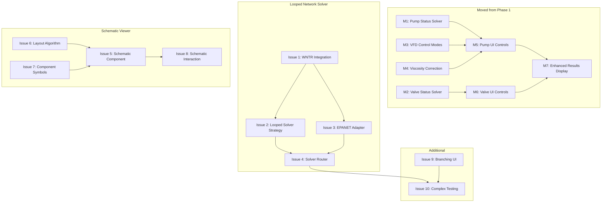

# Phase 2 GitHub Issues

This document contains all GitHub issues for Phase 2 of OpenSolve Pipe.

**Phase 2 Goal:** Support looped networks with EPANET integration and provide visual schematic representation.

**Estimated Complexity:** High (4-5 weeks)

---

## Issue Status Summary

| Doc # | Title | GitHub Issue | PR | Status |
|-------|-------|--------------|----|----|
| | **Moved from Phase 1** | | | |
| M1 | Implement pump status handling in solver | [#107](https://github.com/ccirone2/opensolve-pipe/issues/107) | - | 🔲 Open |
| M2 | Implement valve status handling in solver | [#108](https://github.com/ccirone2/opensolve-pipe/issues/108) | - | 🔲 Open |
| M3 | Implement VFD pump control modes | [#109](https://github.com/ccirone2/opensolve-pipe/issues/109) | - | 🔲 Open |
| M4 | Implement pump viscosity correction | [#110](https://github.com/ccirone2/opensolve-pipe/issues/110) | - | 🔲 Open |
| M5 | Add pump operating mode UI controls | [#111](https://github.com/ccirone2/opensolve-pipe/issues/111) | - | 🔲 Open |
| M6 | Add valve status UI controls | [#112](https://github.com/ccirone2/opensolve-pipe/issues/112) | - | 🔲 Open |
| M7 | Update results display for enhanced outputs | [#113](https://github.com/ccirone2/opensolve-pipe/issues/113) | - | 🔲 Open |
| | **Looped Network Solver** | | | |
| 1 | Backend - WNTR/EPANET Integration | - | - | 🔲 Not Created |
| 2 | Backend - Looped Network Solver Strategy | - | - | 🔲 Not Created |
| 3 | Backend - Component Chain to EPANET Adapter | - | - | 🔲 Not Created |
| 4 | Backend - Solver Router Enhancement | - | - | 🔲 Not Created |
| | **Schematic Viewer** | | | |
| 5 | Frontend - Schematic Viewer Component | - | - | 🔲 Not Created |
| 6 | Frontend - Graph Layout Algorithm | - | - | 🔲 Not Created |
| 7 | Frontend - Component Symbols | - | - | 🔲 Not Created |
| 8 | Frontend - Schematic Interaction | - | - | 🔲 Not Created |
| | **Additional Features** | | | |
| 9 | Frontend - Branching UI Support | - | - | 🔲 Not Created |
| 10 | Testing - Complex Network Validation | - | - | 🔲 Not Created |

**Progress:** 0 of 17 issues completed (0%)

---

## Success Criteria

- [ ] Users can model looped networks (closed loops with multiple flow paths)
- [ ] Users can model parallel pump configurations
- [ ] Schematic auto-generates from component chain
- [ ] Schematic is interactive (click element → open panel)
- [ ] Solver converges for complex topologies (Hardy Cross / EPANET)
- [ ] Pump/valve status affects solver behavior
- [ ] VFD pumps can control pressure or flow

---

## Issues Moved from Phase 1

These issues were created during Phase 1 but deferred to Phase 2:

### M1: Implement Pump Status Handling in Solver

> 🔲 **OPEN** - [GitHub Issue #107](https://github.com/ccirone2/opensolve-pipe/issues/107)

**Labels:** `backend`, `solver`, `Phase 2`

**Description:**
Implement solver logic to handle pump status states (running, off_check, off_no_check, locked_out).

**Tasks:**

- [ ] Handle `running` status (normal pump curve operation)
- [ ] Handle `off_check` status (zero flow, check valve prevents backflow)
- [ ] Handle `off_no_check` status (allows reverse flow through pump)
- [ ] Handle `locked_out` status (pump completely isolated)
- [ ] Update system curve generation for off pumps
- [ ] Write tests for each status state

**Dependencies:** None (models already exist)

---

### M2: Implement Valve Status Handling in Solver

> 🔲 **OPEN** - [GitHub Issue #108](https://github.com/ccirone2/opensolve-pipe/issues/108)

**Labels:** `backend`, `solver`, `Phase 2`

**Description:**
Implement solver logic to handle valve status states (active, isolated, failed_open, failed_closed, locked_open).

**Tasks:**

- [ ] Handle `active` status (normal valve operation with K-factor)
- [ ] Handle `isolated` status (zero flow, infinite resistance)
- [ ] Handle `failed_open` status (fully open, minimum K-factor)
- [ ] Handle `failed_closed` status (zero flow, same as isolated)
- [ ] Handle `locked_open` status (fully open, cannot throttle)
- [ ] Update control valve logic for each status
- [ ] Write tests for each status state

**Dependencies:** None (models already exist)

---

### M3: Implement VFD Pump Control Modes

> 🔲 **OPEN** - [GitHub Issue #109](https://github.com/ccirone2/opensolve-pipe/issues/109)

**Labels:** `backend`, `solver`, `Phase 2`, `critical`

**Description:**
Implement Variable Frequency Drive (VFD) control modes for pumps.

**Tasks:**

- [ ] Implement `fixed_speed` mode (use rated curve)
- [ ] Implement `variable_speed` mode (affinity laws for speed adjustment)
- [ ] Implement `controlled_pressure` mode (VFD adjusts to maintain setpoint)
- [ ] Implement `controlled_flow` mode (VFD adjusts to maintain setpoint)
- [ ] Add affinity law calculations (Q ∝ N, H ∝ N², P ∝ N³)
- [ ] Iterate speed to achieve setpoint in controlled modes
- [ ] Handle speed limits (min/max frequency)
- [ ] Update `PumpResult` with `actual_speed` field
- [ ] Write tests comparing VFD operation vs fixed speed

**Hydraulic Reference:**

- Affinity laws: Q₂/Q₁ = N₂/N₁, H₂/H₁ = (N₂/N₁)², P₂/P₁ = (N₂/N₁)³
- Typical VFD range: 30-100% speed

---

### M4: Implement Pump Viscosity Correction

> 🔲 **OPEN** - [GitHub Issue #110](https://github.com/ccirone2/opensolve-pipe/issues/110)

**Labels:** `backend`, `solver`, `Phase 2`

**Description:**
Implement viscosity correction factors per ANSI/HI 9.6.7.

**Tasks:**

- [ ] Calculate C_Q (flow correction factor)
- [ ] Calculate C_H (head correction factor)
- [ ] Calculate C_η (efficiency correction factor)
- [ ] Apply corrections when `viscosity_correction_enabled` is true
- [ ] Handle viscosity limits (when corrections apply)
- [ ] Update `ViscosityCorrectionFactors` in results
- [ ] Write tests with known viscosity correction cases

**Reference:** ANSI/HI 9.6.7 - Effects of Liquid Viscosity on Rotodynamic Pump Performance

---

### M5: Add Pump Operating Mode UI Controls

> 🔲 **OPEN** - [GitHub Issue #111](https://github.com/ccirone2/opensolve-pipe/issues/111)

**Labels:** `frontend`, `forms`, `Phase 2`

**Description:**
Add UI controls to PumpPanel for operating mode and status selection.

**Tasks:**

- [ ] Add operating mode dropdown (fixed_speed, variable_speed, controlled_pressure, controlled_flow, off)
- [ ] Add status dropdown (running, off_check, off_no_check, locked_out)
- [ ] Show setpoint input when mode is `controlled_pressure` or `controlled_flow`
- [ ] Add speed override input for `variable_speed` mode
- [ ] Add viscosity correction toggle
- [ ] Update form validation for required setpoints
- [ ] Disable irrelevant fields based on mode/status

**Dependencies:** M1, M3 (solver must support modes first)

---

### M6: Add Valve Status UI Controls

> 🔲 **OPEN** - [GitHub Issue #112](https://github.com/ccirone2/opensolve-pipe/issues/112)

**Labels:** `frontend`, `forms`, `Phase 2`

**Description:**
Add UI controls to ValvePanel for status selection.

**Tasks:**

- [ ] Add status dropdown (active, isolated, failed_open, failed_closed, locked_open)
- [ ] Show visual indicator for failure states
- [ ] Disable setpoint inputs for locked states
- [ ] Update form validation based on status

**Dependencies:** M2 (solver must support status first)

---

### M7: Update Results Display for Enhanced Outputs

> 🔲 **OPEN** - [GitHub Issue #113](https://github.com/ccirone2/opensolve-pipe/issues/113)

**Labels:** `frontend`, `results`, `Phase 2`

**Description:**
Update results panel to display enhanced pump and valve result fields.

**Tasks:**

- [ ] Display pump `actual_speed` vs rated speed
- [ ] Display pump status in results
- [ ] Display viscosity correction factors when applied
- [ ] Display control valve position (% open)
- [ ] Display valve status in results
- [ ] Add visual warnings for failure modes
- [ ] Show VFD operating outside optimal range warning

**Dependencies:** M1, M2, M3, M4 (solver must produce enhanced results)

---

## Looped Network Solver

### Issue 1: Backend - WNTR/EPANET Integration

**Labels:** `backend`, `solver`, `Phase 2`, `critical`

**Description:**
Integrate WNTR (Water Network Tool for Resilience) library for solving looped networks using EPANET.

**Related Files:**

- `apps/api/src/opensolve_pipe/services/solver/epanet.py` (new)
- `pyproject.toml` (add wntr dependency)

**Tasks:**

- [ ] Add `wntr` to project dependencies
- [ ] Create EPANET wrapper module
- [ ] Implement WNTR network creation from our component model
- [ ] Map our component types to WNTR equivalents
- [ ] Handle WNTR solver execution
- [ ] Convert WNTR results back to our `SolvedState` format
- [ ] Add error handling for EPANET solver failures
- [ ] Write tests comparing WNTR results to simple solver for simple networks

**Dependencies:** `wntr` library (pip install wntr)

**Complexity:** Very High - Complex library integration

---

### Issue 2: Backend - Looped Network Solver Strategy

**Labels:** `backend`, `solver`, `Phase 2`, `critical`

**Description:**
Create a `LoopedSolver` strategy that uses EPANET for networks with closed loops.

**Related Files:**

- `apps/api/src/opensolve_pipe/services/solver/strategies/looped.py` (new)

**Tasks:**

- [ ] Create `LoopedSolver` class implementing `NetworkSolver` protocol
- [ ] Implement `can_solve()` to detect looped networks
- [ ] Implement `solve()` using WNTR/EPANET
- [ ] Register `LoopedSolver` in `SolverRegistry`
- [ ] Handle fallback if EPANET fails to converge
- [ ] Write tests for looped network detection

**Dependencies:** Issue 1 (WNTR Integration)

---

### Issue 3: Backend - Component Chain to EPANET Adapter

**Labels:** `backend`, `solver`, `Phase 2`

**Description:**
Create adapter to convert our port-based component model to EPANET node-link format.

**Related Files:**

- `apps/api/src/opensolve_pipe/services/solver/epanet_adapter.py` (new)

**Tasks:**

- [ ] Map `Reservoir` → WNTR Reservoir node
- [ ] Map `Tank` → WNTR Tank node
- [ ] Map `Junction` → WNTR Junction node
- [ ] Map `Pump` → WNTR Pump link
- [ ] Map `Valve` → WNTR Valve link (PRV, PSV, FCV, etc.)
- [ ] Map `PipeConnection` → WNTR Pipe link
- [ ] Handle branch components (create implicit junctions)
- [ ] Map fittings to equivalent pipe lengths
- [ ] Convert our pump curves to WNTR curve format
- [ ] Handle reference nodes (fixed head boundaries)
- [ ] Write adapter tests with various topologies

**Complexity:** High - Complex mapping logic

---

### Issue 4: Backend - Solver Router Enhancement

**Labels:** `backend`, `solver`, `Phase 2`

**Description:**
Enhance solver router to automatically select between Simple, Branching, and Looped solvers.

**Related Files:**

- `apps/api/src/opensolve_pipe/services/solver/registry.py`
- `apps/api/src/opensolve_pipe/services/solver/network.py`

**Tasks:**

- [ ] Add `NetworkType.LOOPED` detection in `classify_network()`
- [ ] Update `SolverRegistry` to include `LoopedSolver`
- [ ] Add clear error messages when no solver can handle topology
- [ ] Log which solver was selected and why
- [ ] Write tests for solver selection logic

**Dependencies:** Issue 2 (Looped Solver Strategy)

---

## Schematic Viewer

### Issue 5: Frontend - Schematic Viewer Component

**Labels:** `frontend`, `ui`, `Phase 2`, `critical`

**Description:**
Create the main schematic viewer component using SVG and D3.js.

**Related Files:**

- `apps/web/src/lib/components/schematic/SchematicViewer.svelte` (new)
- `apps/web/src/lib/components/schematic/SchematicCanvas.svelte` (new)

**Tasks:**

- [ ] Create `SchematicViewer` component (main container)
- [ ] Create SVG canvas with zoom/pan support
- [ ] Implement viewport management (fit to screen, zoom controls)
- [ ] Add mobile pinch-to-zoom support
- [ ] Add pan with drag support
- [ ] Create "Fit to View" button
- [ ] Add zoom level indicator
- [ ] Write component tests

**Dependencies:** D3.js library

---

### Issue 6: Frontend - Graph Layout Algorithm

**Labels:** `frontend`, `visualization`, `Phase 2`, `critical`

**Description:**
Implement automatic graph layout for positioning components in schematic.

**Related Files:**

- `apps/web/src/lib/utils/schematic/layout.ts` (new)

**Tasks:**

- [ ] Evaluate layout libraries (dagre, elkjs, d3-force)
- [ ] Implement component positioning algorithm
- [ ] Handle linear chains (horizontal flow)
- [ ] Handle branches (split/merge points)
- [ ] Handle parallel paths (equal spacing)
- [ ] Handle loops (avoid overlaps)
- [ ] Add manual position override support
- [ ] Write layout tests with various topologies

**Complexity:** Very High - Graph algorithms

**Options:**

- **dagre:** Good for DAGs, may struggle with loops
- **elkjs:** Powerful but complex, good for all topologies
- **d3-force:** Simple but may need tuning for hydraulic networks

---

### Issue 7: Frontend - Component Symbols

**Labels:** `frontend`, `visualization`, `Phase 2`

**Description:**
Create SVG symbols for all component types.

**Related Files:**

- `apps/web/src/lib/components/schematic/symbols/` (new directory)
- `apps/web/static/symbols/` (SVG files)

**Tasks:**

- [ ] Create `Reservoir` symbol (tank with water level)
- [ ] Create `Tank` symbol (cylindrical tank)
- [ ] Create `Pump` symbol (circle with arrow)
- [ ] Create `Valve` symbols (gate, ball, check, PRV, PSV, FCV)
- [ ] Create `Junction` symbol (dot or circle)
- [ ] Create `Tee`/`Wye`/`Cross` symbols
- [ ] Create `HeatExchanger` symbol (coil or plate)
- [ ] Create `Strainer` symbol (basket pattern)
- [ ] Create `Orifice` symbol (restriction plate)
- [ ] Create `Sprinkler` symbol (spray pattern)
- [ ] Create `Plug` symbol (cap)
- [ ] Create `ReferenceNode` symbol (boundary marker)
- [ ] Add flow direction arrows
- [ ] Support dark/light theme variants
- [ ] Export as reusable Svelte components

**Reference:** P&ID standard symbols (ISA-5.1)

---

### Issue 8: Frontend - Schematic Interaction

**Labels:** `frontend`, `ui`, `Phase 2`

**Description:**
Add interactivity to schematic (click, hover, selection).

**Related Files:**

- `apps/web/src/lib/components/schematic/SchematicComponent.svelte` (new)
- `apps/web/src/lib/components/schematic/SchematicPipe.svelte` (new)

**Tasks:**

- [ ] Implement click handler (select component)
- [ ] Open panel for selected component
- [ ] Add hover highlight effect
- [ ] Show component name tooltip on hover
- [ ] Display result values on hover (flow, pressure)
- [ ] Add selection highlight (border/glow)
- [ ] Sync selection with panel navigator
- [ ] Support keyboard navigation (arrow keys)
- [ ] Write interaction tests

---

## Additional Features

### Issue 9: Frontend - Branching UI Support

**Labels:** `frontend`, `ui`, `Phase 2`

**Description:**
Enhance panel navigator to support creating and managing branches.

**Related Files:**

- `apps/web/src/lib/components/panel/BranchSelector.svelte` (new)

**Tasks:**

- [ ] Add branch creation UI (split flow at component)
- [ ] Show all branches from current component
- [ ] Add "Add Branch" button for branch components
- [ ] Handle loop closure (connect to existing component)
- [ ] Update URL encoding for branching networks
- [ ] Validate branching topology (no orphaned branches)
- [ ] Write branching UI tests

---

### Issue 10: Testing - Complex Network Validation

**Labels:** `testing`, `Phase 2`, `critical`

**Description:**
Comprehensive testing of complex network topologies against EPANET reference.

**Tasks:**

- [ ] Create test case: Parallel pumps
- [ ] Create test case: Series pumps
- [ ] Create test case: Looped distribution system
- [ ] Create test case: Building riser with multiple floors
- [ ] Create test case: Fire sprinkler loop
- [ ] Compare results to EPANET standalone (< 1% deviation)
- [ ] Test solver convergence for each topology
- [ ] Benchmark solve times for complex networks
- [ ] Document any discrepancies

**Acceptance Criteria:**

- All test cases solve successfully
- Results match EPANET within 1%
- Solve time < 5 seconds for 50-component networks

---

## Phase 2 Dependencies



**Critical Path:** WNTR Integration → Looped Solver → Solver Router → Complex Testing

**Parallel Track:** Schematic Viewer can be developed in parallel with solver work.

---

## Estimated Effort

| Category | Issues | Complexity | Estimate |
|----------|--------|------------|----------|
| Moved from Phase 1 | M1-M7 | Medium | 1-2 weeks |
| Looped Network Solver | I1-I4 | Very High | 2-3 weeks |
| Schematic Viewer | I5-I8 | High | 2-3 weeks |
| Additional Features | I9-I10 | Medium | 1 week |

**Total Estimate:** 4-5 weeks with 2-3 developers

---

## gh CLI Commands (Create Issues)

```bash
# Issue 1: WNTR Integration
gh issue create \
  --title "Backend - WNTR/EPANET Integration for Looped Networks" \
  --body "Integrate WNTR library for solving looped networks using EPANET.

**Tasks:**
- [ ] Add \`wntr\` to project dependencies
- [ ] Create EPANET wrapper module
- [ ] Implement WNTR network creation from our component model
- [ ] Map our component types to WNTR equivalents
- [ ] Handle WNTR solver execution
- [ ] Convert WNTR results back to our \`SolvedState\` format
- [ ] Write tests comparing WNTR results to simple solver

**Acceptance Criteria:**
- WNTR solves simple networks with same results as SimpleSolver
- WNTR handles looped networks that SimpleSolver cannot" \
  --label "backend,solver,Phase 2,critical"

# Issue 5: Schematic Viewer
gh issue create \
  --title "Frontend - Create Schematic Viewer Component" \
  --body "Create the main schematic viewer component using SVG and D3.js.

**Tasks:**
- [ ] Create \`SchematicViewer\` component (main container)
- [ ] Create SVG canvas with zoom/pan support
- [ ] Implement viewport management
- [ ] Add mobile pinch-to-zoom support
- [ ] Add zoom level indicator
- [ ] Write component tests

**Acceptance Criteria:**
- Schematic displays all components
- Zoom/pan works on desktop and mobile
- Responsive to window resize" \
  --label "frontend,ui,Phase 2,critical"

# Add more issues as needed...
```

---

## Summary

**Phase 2 adds:**

1. **Looped Network Support** - EPANET integration for complex topologies
2. **Schematic Viewer** - Visual representation of the network
3. **Advanced Pump/Valve Features** - VFD control, status handling, viscosity correction
4. **Enhanced Results** - Detailed pump/valve operating information

**Key Deliverables:**

- Users can model any network topology (simple, branching, looped)
- Visual schematic auto-generates and is interactive
- Pumps can operate in VFD modes (pressure/flow control)
- Valve status affects solver behavior
- Results show detailed operating conditions
