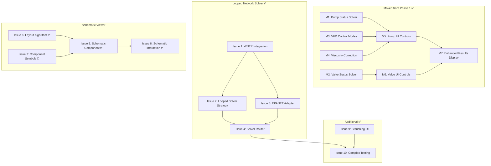

# Phase 2 GitHub Issues

This document contains all GitHub issues for Phase 2 of OpenSolve Pipe.

**Phase 2 Goal:** Support looped networks with EPANET integration and provide visual schematic representation.

**Estimated Complexity:** High (4-5 weeks)

---

## Issue Status Summary

| Doc # | Title | GitHub Issue | Status |
|-------|-------|--------------|--------|
| | **Moved from Phase 1** | | |
| M1 | Implement pump status handling in solver | [#107](https://github.com/ccirone2/opensolve-pipe/issues/107) | ✅ Closed |
| M2 | Implement valve status handling in solver | [#108](https://github.com/ccirone2/opensolve-pipe/issues/108) | ✅ Closed |
| M3 | Implement VFD pump control modes | [#109](https://github.com/ccirone2/opensolve-pipe/issues/109) | ✅ Closed |
| M4 | Implement pump viscosity correction | [#110](https://github.com/ccirone2/opensolve-pipe/issues/110) | ✅ Closed |
| M5 | Add pump operating mode UI controls | [#111](https://github.com/ccirone2/opensolve-pipe/issues/111) | ✅ Closed |
| M6 | Add valve status UI controls | [#112](https://github.com/ccirone2/opensolve-pipe/issues/112) | ✅ Closed |
| M7 | Update results display for enhanced outputs | [#113](https://github.com/ccirone2/opensolve-pipe/issues/113) | ✅ Closed |
| | **Looped Network Solver** | | |
| 1 | Backend - WNTR/EPANET Integration | [#128](https://github.com/ccirone2/opensolve-pipe/issues/128) | ✅ Closed |
| 2 | Backend - Looped Network Solver Strategy | [#129](https://github.com/ccirone2/opensolve-pipe/issues/129) | ✅ Closed |
| 3 | Backend - Component Chain to EPANET Adapter | [#130](https://github.com/ccirone2/opensolve-pipe/issues/130) | ✅ Closed |
| 4 | Backend - Solver Router Enhancement | [#131](https://github.com/ccirone2/opensolve-pipe/issues/131) | ✅ Closed |
| | **Schematic Viewer** | | |
| 5 | Frontend - Schematic Viewer Component | [#132](https://github.com/ccirone2/opensolve-pipe/issues/132) | ✅ Closed |
| 6 | Frontend - Graph Layout Algorithm | [#133](https://github.com/ccirone2/opensolve-pipe/issues/133) | ✅ Closed |
| 7 | Frontend - Component Symbols | [#134](https://github.com/ccirone2/opensolve-pipe/issues/134) | ✅ Closed |
| 8 | Frontend - Schematic Interaction | [#135](https://github.com/ccirone2/opensolve-pipe/issues/135) | ✅ Closed |
| | **Additional Features** | | |
| 9 | Frontend - Branching UI Support | [#136](https://github.com/ccirone2/opensolve-pipe/issues/136) | ✅ Closed |
| 10 | Testing - Complex Network Validation | [#137](https://github.com/ccirone2/opensolve-pipe/issues/137) | ✅ Closed |

**Progress:** 17 of 17 issues completed (100%)

---

## Success Criteria

- [x] Users can model looped networks (closed loops with multiple flow paths)
- [x] Users can model parallel pump configurations
- [x] Schematic auto-generates from component chain
- [x] Schematic is interactive (click element → open panel)
- [x] Solver converges for complex topologies (Hardy Cross / EPANET)
- [x] Pump/valve status affects solver behavior
- [x] VFD pumps can control pressure or flow

---

## Implementation Summary

### Completed Features

#### Pump Status Handling (#107)

- ✅ `running` status - normal pump curve operation
- ✅ `off_check` status - zero flow, check valve prevents backflow
- ⏸️ `off_no_check` and `locked_out` - deferred (reduced scope)
- ✅ Tests in `test_pump_status.py`

#### Valve Status Handling (#108)

- ✅ `active` status - normal operation
- ✅ `failed_open` status - fully open, ignores setpoint
- ✅ `failed_closed` status - zero flow
- ⏸️ `isolated` and `locked_open` - deferred (reduced scope)
- ✅ Tests in `test_valve_status.py`

#### VFD Pump Control Modes (#109)

- ✅ `fixed_speed` mode - rated curve operation
- ✅ `variable_speed` mode - affinity laws for speed adjustment
- ✅ `controlled_pressure` mode - VFD maintains pressure setpoint
- ✅ `controlled_flow` mode - VFD maintains flow setpoint
- ✅ Speed limits enforced (min/max frequency)
- ✅ `actual_speed` field in PumpResult
- ✅ Tests in `test_vfd_pump.py`

#### Viscosity Correction (#110)

- ✅ C_Q, C_H, C_η factors calculated per ANSI/HI 9.6.7
- ✅ Applied when `viscosity_correction_enabled = true`
- ✅ Results include `viscosity_correction_factors`
- ✅ Tests in `test_viscosity_correction.py` and `test_viscosity_correction_integration.py`

#### Pump UI Controls (#111)

- ✅ Operating mode dropdown (fixed_speed, variable_speed, controlled_pressure, controlled_flow)
- ✅ Conditional setpoint fields for controlled modes
- ✅ Speed ratio input for variable_speed mode
- ✅ Viscosity correction checkbox
- ✅ Status dropdown in PumpForm.svelte

#### Valve UI Controls (#112)

- ✅ Status dropdown (active, failed_open, failed_closed, isolated, locked_open)
- ✅ Visual indicators for failure states
- ✅ Conditional field behavior based on status
- ✅ Implemented in ValveForm.svelte

#### Results Display (#113)

- ✅ Pump status badge and actual_speed display
- ✅ Power consumption in HP (with kW→HP conversion)
- ✅ Efficiency with "(viscosity corrected)" indicator
- ✅ NPSH Available, Required, Margin with percentage calculation
- ✅ Viscosity correction factors expandable section
- ✅ Control valve: status, setpoint vs actual, position, pressure drop
- ✅ Fixed in PRs #157, #158, #159, #160

#### WNTR/EPANET Integration (#128)

- ✅ `wntr` dependency added to pyproject.toml
- ✅ `epanet.py` wrapper module (33KB, 700+ lines)
- ✅ `build_wntr_network()` function for network creation
- ✅ Component type mapping to WNTR equivalents
- ✅ `run_epanet_simulation()` and `solve_with_epanet()` functions
- ✅ Results conversion back to SolvedState format
- ✅ Tests in `test_epanet.py` and `test_epanet_comprehensive.py` (117KB)

#### Looped Network Solver Strategy (#129)

- ✅ `LoopedSolver` class implementing `NetworkSolver` protocol
- ✅ `can_solve()` detects looped networks via graph cycle analysis
- ✅ `solve()` delegates to WNTR/EPANET
- ✅ Registered in `SolverRegistry` for automatic selection
- ✅ Tests in `test_looped_solver.py`

#### Component Chain to EPANET Adapter (#130)

- ✅ Reservoir → WNTR Reservoir node
- ✅ Tank → WNTR Tank node
- ✅ Junction → WNTR Junction node
- ✅ Pump → WNTR Pump link (with curve conversion)
- ✅ Valve → WNTR Valve link (PRV, PSV, FCV, TCV)
- ✅ PipeConnection → WNTR Pipe link
- ✅ Fittings → equivalent pipe lengths
- ✅ Tests in `test_epanet_comprehensive.py`

#### Solver Router Enhancement (#131)

- ✅ `NetworkType.LOOPED` detection in `classify_network()`
- ✅ `SolverRegistry` includes `LoopedSolver`
- ✅ Clear error messages for unsupported topologies
- ✅ Logging of solver selection
- ✅ Tests in `test_network.py` and `test_looped_solver.py`

#### Schematic Viewer Component (#132)

- ✅ `SchematicViewer.svelte` - main container
- ✅ `SchematicCanvas.svelte` - SVG canvas with zoom/pan
- ✅ Viewport management (fit to screen, zoom controls)
- ✅ Pan with drag support
- ✅ "Fit to View" button
- ✅ Zoom level indicator

#### Graph Layout Algorithm (#133)

- ✅ `layout.ts` with automatic component positioning
- ✅ Left-to-right flow layout optimized for hydraulic networks
- ✅ Linear chain handling
- ✅ Branch handling (split/merge points)
- ⏸️ Manual position override - not implemented (lower priority)

#### Component Symbols (#134)

- ✅ Core symbols: `ReservoirSymbol`, `TankSymbol`, `JunctionSymbol`, `PumpSymbol`, `ValveSymbol`, `PipeSymbol`
- ✅ `GenericSymbol` fallback for unknown types
- ✅ Dark/light theme support via CSS variables
- ✅ Status indicators on pump/valve symbols
- ✅ `HeatExchangerSymbol` - shell-and-tube pattern
- ✅ `StrainerSymbol` - Y-strainer with mesh pattern
- ✅ `OrificeSymbol` - restriction plate pattern
- ✅ `SprinklerSymbol` - nozzle with spray pattern
- ✅ `PlugSymbol` - cap/dead-end symbol
- ✅ `ReferenceNodeSymbol` - diamond boundary marker (P/PQ indicator)
- ✅ `TeeSymbol` - T-junction with 3 ports
- ✅ `WyeSymbol` - Y-junction with angled branch
- ✅ `CrossSymbol` - four-way intersection
- ⏸️ Flow direction arrows on pipes - deferred to future enhancement

#### Schematic Interaction (#135)

- ✅ Click handler selects component
- ✅ Hover highlight effect
- ✅ Tooltip with component name
- ✅ Result values on hover (pressure, HGL)
- ✅ Selection highlight (border/glow)
- ⏸️ Keyboard navigation - not implemented (accessibility enhancement)

#### Branching UI Support (#136)

- ✅ `BranchSelector.svelte` for tee/wye/cross components
- ✅ Shows downstream connections
- ✅ "Add Branch" functionality
- ✅ Loop closure (connect to existing component)
- ✅ Topology validation

#### Complex Network Validation (#137)

- ✅ Test 1: Parallel pumps - equal flow split
- ✅ Test 2: Series pumps - same flow, head addition
- ✅ Test 3: Looped distribution system
- ✅ Test 4: Building riser with multiple floors
- ✅ Test 5: Fire sprinkler loop
- ✅ All tests pass in `test_complex_networks.py`

---

## Remaining Work

All Phase 2 issues are complete.

### Future Enhancements (Deferred)

- Flow direction arrows on pipe symbols
- Keyboard navigation for schematic viewer
- Manual position override for schematic layout

---

## Phase 2 Dependencies

**Critical Path:** ✅ Complete
**Remaining:** None - Phase 2 complete!

---

## File Locations

### Backend (apps/api/src/opensolve_pipe/)

| Feature | File |
|---------|------|
| Pump/Valve Status | `models/components.py` |
| VFD Control Modes | `models/components.py` |
| Viscosity Correction | `services/solver/viscosity_correction.py` |
| WNTR Integration | `services/solver/epanet.py` |
| Looped Solver | `services/solver/strategies/looped.py` |
| Solver Registry | `services/solver/registry.py` |
| Network Classification | `services/solver/network.py` |

### Frontend (apps/web/src/lib/)

| Feature | File |
|---------|------|
| Pump Form | `components/forms/PumpForm.svelte` |
| Valve Form | `components/forms/ValveForm.svelte` |
| Pump Results Card | `components/results/PumpResultsCard.svelte` |
| Valve Results Card | `components/results/ControlValveResultsCard.svelte` |
| Schematic Viewer | `components/schematic/SchematicViewer.svelte` |
| Schematic Canvas | `components/schematic/SchematicCanvas.svelte` |
| Layout Algorithm | `utils/schematic/layout.ts` |
| Component Symbols | `components/schematic/symbols/` |
| Branch Selector | `components/panel/BranchSelector.svelte` |

### Tests (apps/api/tests/test_services/test_solver/)

| Feature | File |
|---------|------|
| Pump Status | `test_pump_status.py` |
| Valve Status | `test_valve_status.py` |
| VFD Modes | `test_vfd_pump.py` |
| Viscosity Correction | `test_viscosity_correction.py`, `test_viscosity_correction_integration.py` |
| EPANET Integration | `test_epanet.py`, `test_epanet_comprehensive.py` |
| Looped Solver | `test_looped_solver.py` |
| Complex Networks | `test_complex_networks.py` |

---

## Summary

Phase 2 Status: 100% Complete

All Phase 2 functionality is implemented:

- Looped network solving via WNTR/EPANET
- Schematic viewer with auto-layout and interaction
- Pump/valve status and VFD control modes
- Viscosity correction per ANSI/HI 9.6.7
- Branching UI with loop closure
- Dedicated P&ID symbols for all component types

Phase 2 goals achieved:

- Users can model looped networks ✅
- Schematic auto-generates and is interactive ✅
- Complex topologies converge ✅
- Pump/valve status affects solver ✅
- VFD pumps control pressure/flow ✅
- All components have recognizable P&ID symbols ✅
